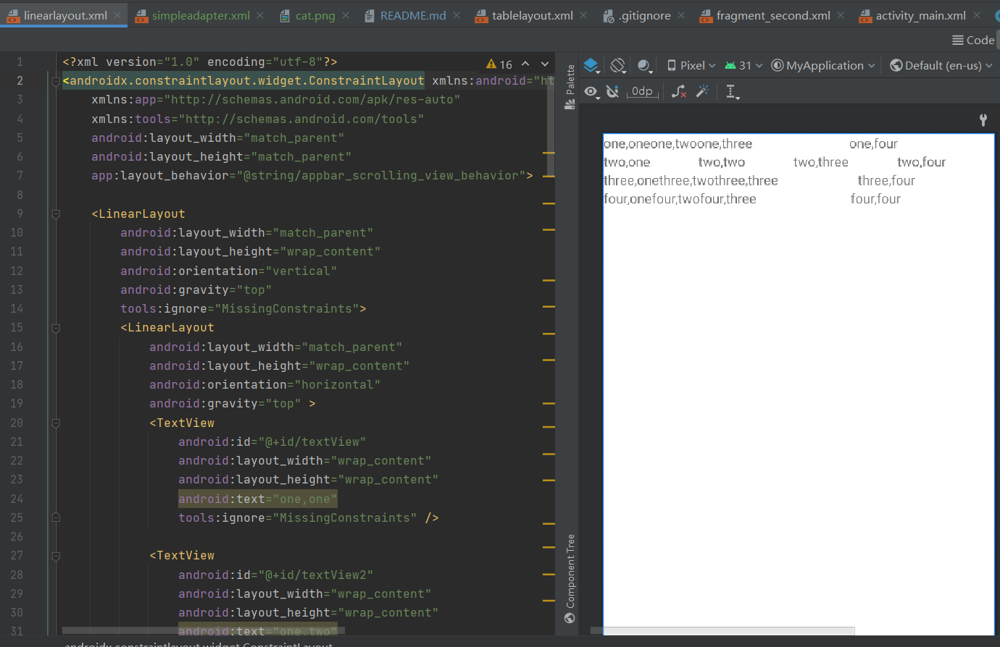
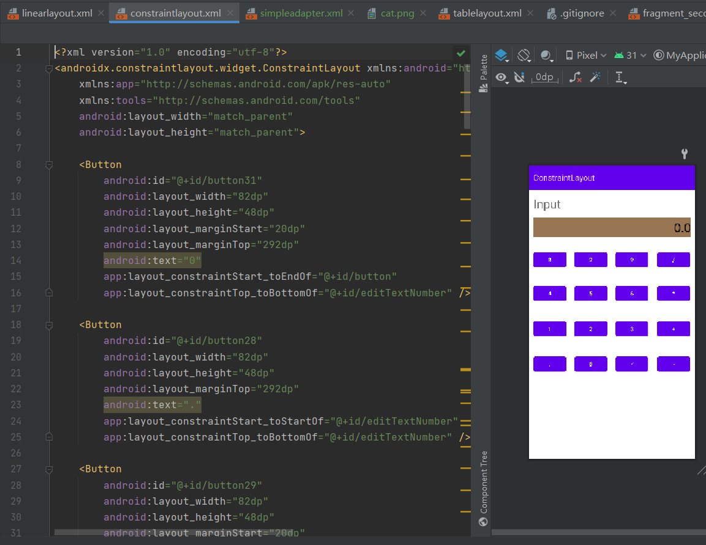
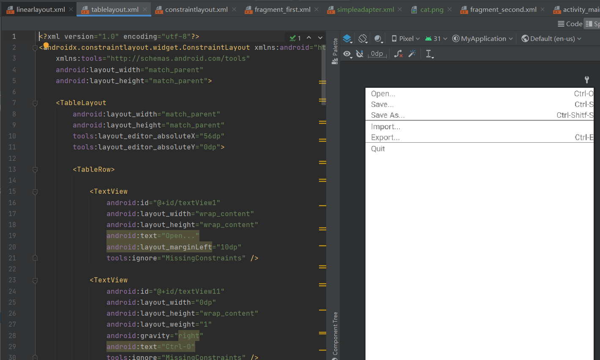
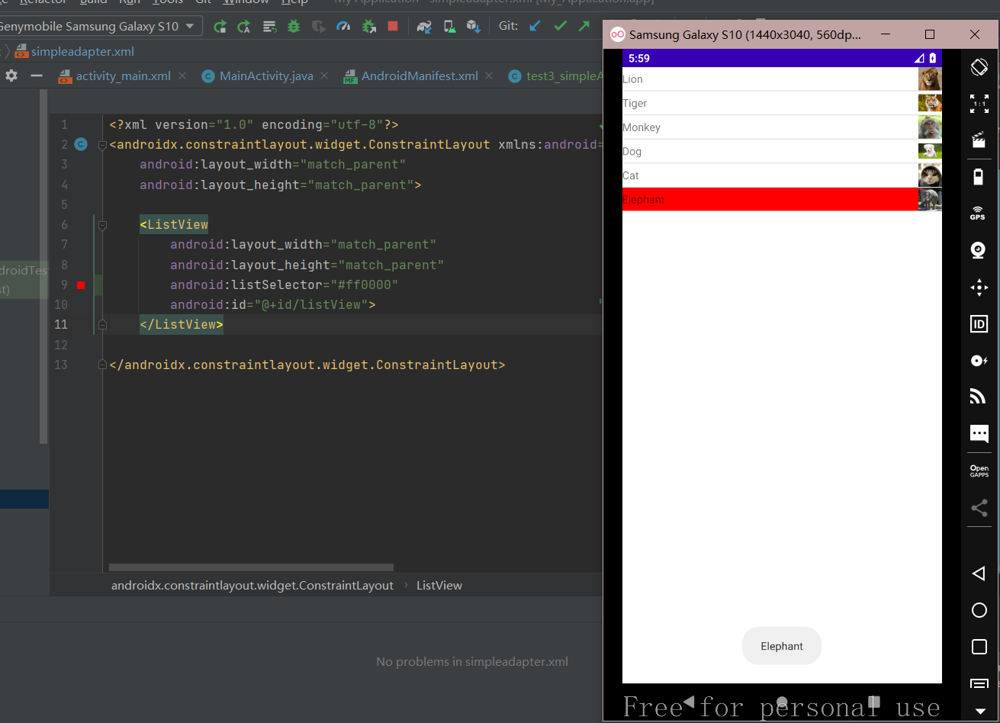
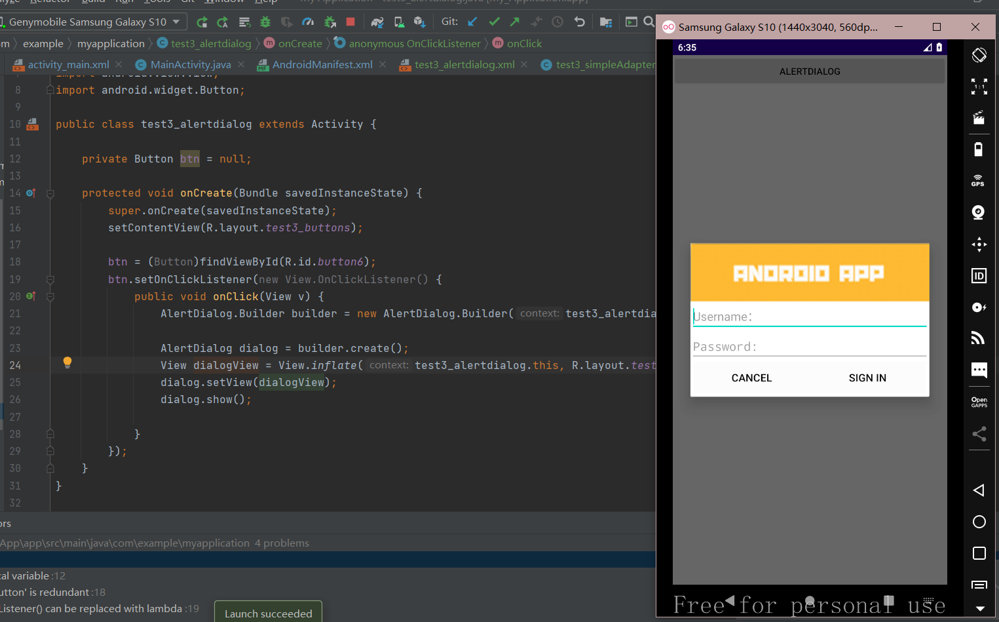
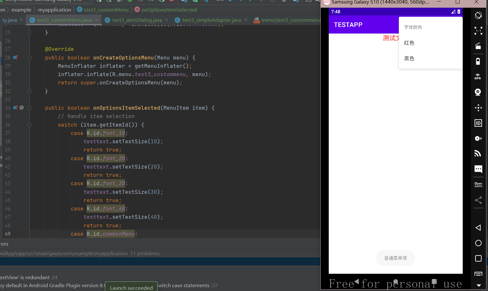

# Anoroid

## 实验2

### linear_layout

### constraint_layout

### table_layout

## 实验3

### simpleAdapter

这里使用android:listSelector="#ff0000"让listView在被选中时呈现红色

### alertDialog

### customMenu

