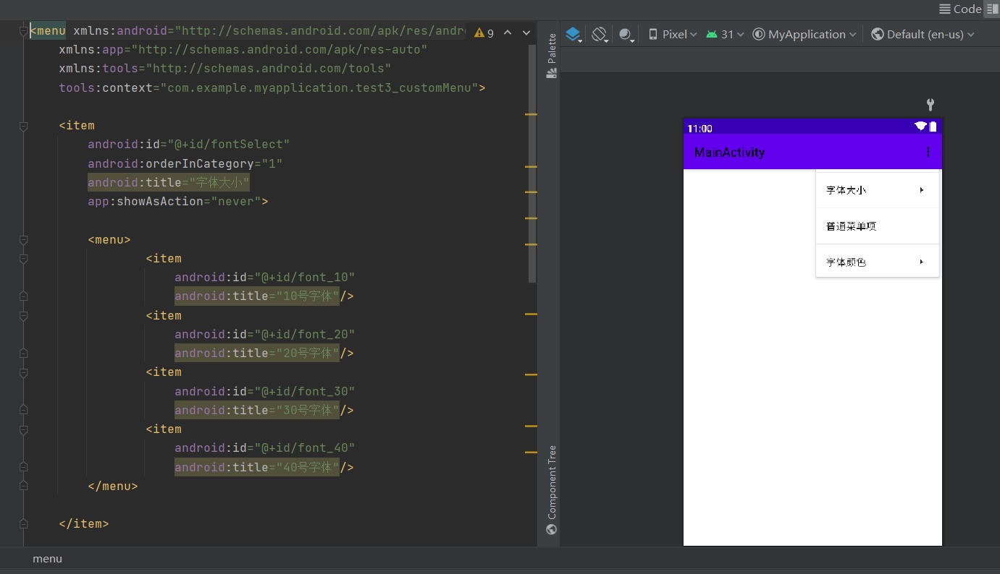
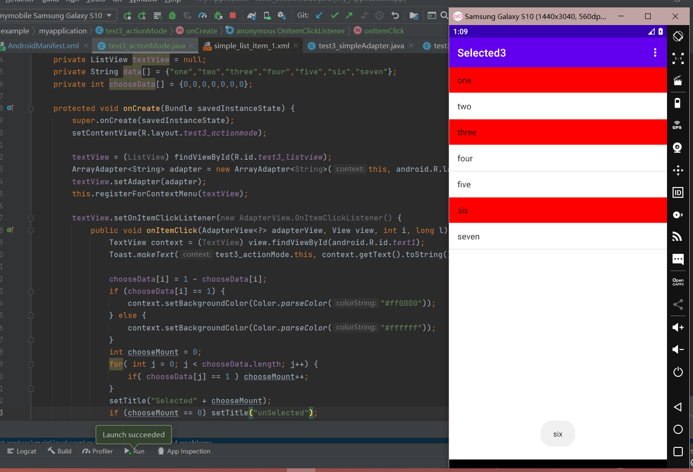

# Anoroid

## 实验2

### linear_layout

### constraint_layout

### table_layout

## 实验3

### simpleAdapter

这里使用android:listSelector="#ff0000"让listView在被选中时呈现红色

### alertDialog

通过创建并修饰builder来完成create()

### customMenu

二元item数组嵌套

### actionMode

设置选中数组chooseData[] = {0,0,0,0,0,0,0};,每次点击菜单时改变数组中元素的值，记录已选项，并重新统计当前选择的数量并在actionBar中显示

